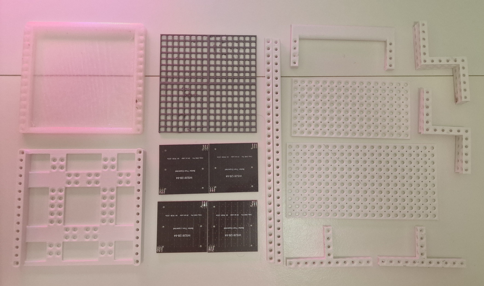
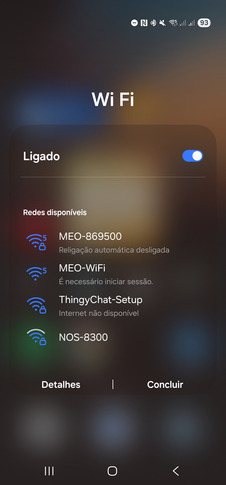
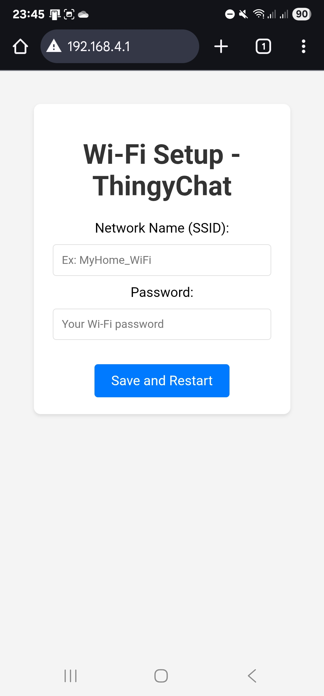
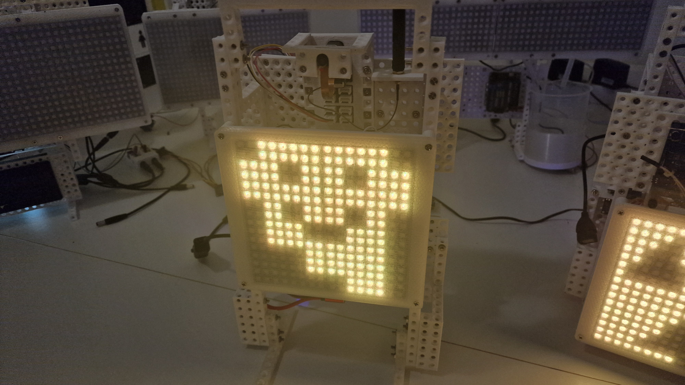
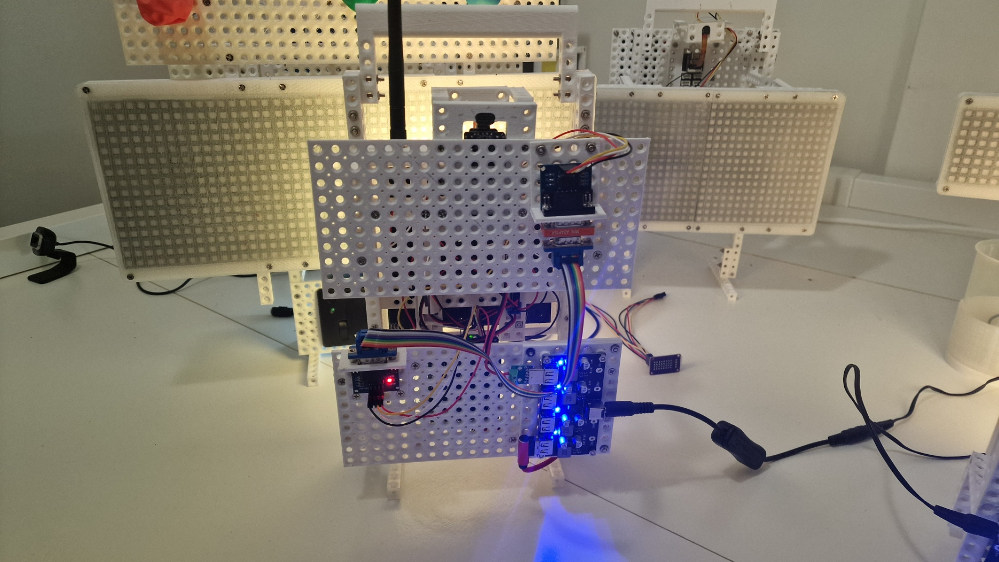
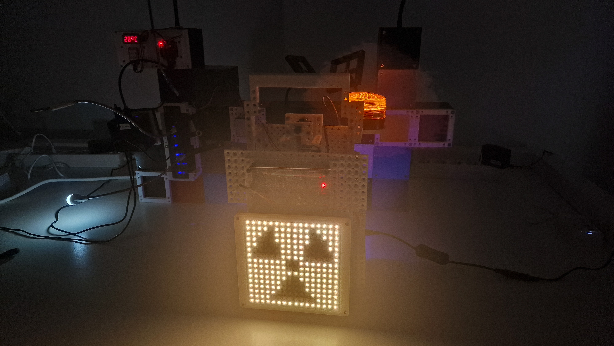
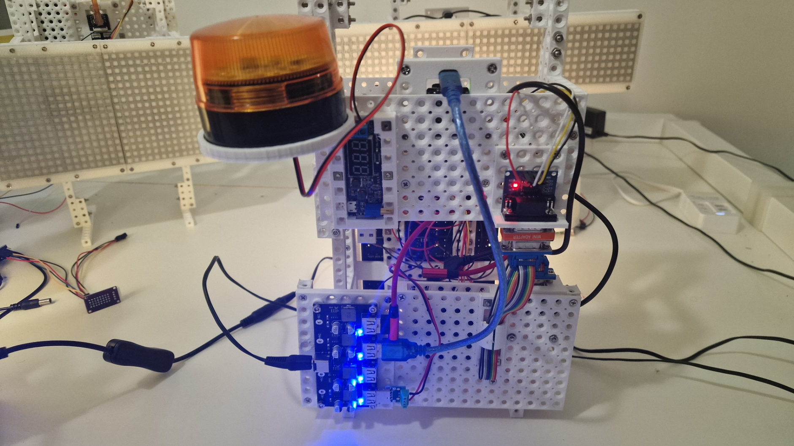

# ThingyChat - An Open-Source Interactive Signage Platform

  

Welcome to ThingyChat! This is an open-source framework designed to empower makers, hobbyists, and creators to build their own smart, connected, and interactive signage. Forget static signs—ThingyChat makes information come alive.

This project is an entry for the **Seeed Studio Interactive Signage Contest 2025**.

---

## 🌟 Core Concept

The goal of ThingyChat is not to be a single device, but a versatile and modular platform. It combines modern web technologies with robust microcontrollers to create a flexible ecosystem.

**The Core Architecture:**
*   **The Brain:** A **Seeed Xiao ESP32-S3** serves as the main processor. It handles Wi-Fi connectivity (with a user-friendly Wi-Fi Manager), runs a WebSocket server for real-time communication, and acts as the main logic controller.
*   **The Muscle:** An **Arduino Uno R4** is connected via serial communication. It acts as a powerful and reliable driver for 5V components like WS2812 LED matrices and 7-segment displays, offloading the real-time display logic from the ESP32.
*   **The Interface:** A **Progressive Web App (PWA)** serves as the universal remote control. It runs in any browser and communicates with the ESP32 via WebSockets, allowing users to send commands, draw emojis, and input data.
*   **The Body:** A fully **modular, 3D-printed mounting system** inspired by Tamiya plates allows for rapid prototyping and easy assembly of different "Thingy" configurations. >I will bre putting the STL files in \3DPrint folder

  

---
## 🛜 WIFI setup

When you bootup your device and it is no able to connect to wifi, you use your phone to setup the initial WIFI configuratiom.

  
  &nbsp;&nbsp;&nbsp;&nbsp;
  
  &nbsp;&nbsp;&nbsp;&nbsp;
  
  &nbsp;&nbsp;&nbsp;&nbsp;

---
## 🚀 The "Thingy" Projects

To demonstrate the platform's versatility, I have developed three initial proof-of-concept projects:

### 1. The Real-Time Emoji Display

This is the core demonstration of the ThingyChat platform. A simple yet powerful sign that brings a web interface directly to a physical display.

*   **Functionality:** Users can draw custom emojis or patterns on a 16x16 grid in the web app. The drawing is transmitted in real-time via WebSockets to the Xiao, which then commands the Arduino to display it instantly on a 256-pixel WS2812 LED matrix.
*   **Tech Showcase:** Highlights the seamless, low-latency communication between a web browser and the hardware.

  
  &nbsp;&nbsp;&nbsp;&nbsp;
  

### 2. The Memento Mori

An interactive and thought-provoking art piece that connects the user to the profound concept of their own lifespan. *"Memento mori" - remember that you will die.*

*   **Functionality:** A user accesses the PWA, selects their country (complete with flag icons), and enters their date of birth. The application fetches real life expectancy data from the World Bank API and calculates three key figures: days already lived, average days remaining, and the percentage of their life completed. These numbers are then displayed on three dedicated 7-segment displays, accompanied by symbolic 8x8 emojis for birth, life, and death.
*   **Tech Showcase:** Demonstrates API integration, personalized data visualization, and creating an emotional impact with technology.

### 3. The Geiger Counter Sign

This project turns invisible environmental data into a clear and understandable public sign. It's a modern-day "Canary in a Coal Mine."

*   **Functionality:** A Geiger-Müller tube detects ambient radiation in real-time. The Arduino counts the pulses (Counts Per Minute - CPM) and sends the data to the Xiao. The Xiao then displays the corresponding status on an LED matrix using intuitive emojis: a smiley face for safe levels, a concerned face for elevated levels, and a skull for danger. The raw CPM is also shown on a 7-segment display.
*   **Tech Showcase:** Real-time sensor data processing, serial communication between microcontrollers, and creating effective data visualization for public awareness.

  
  &nbsp;&nbsp;&nbsp;&nbsp;
  

---

## 🔧 Future Development

ThingyChat is a living project. Future plans include:
*   Adding support for animations and text scrolling.
*   Integrating more Grove sensors (NFC, Air Quality, etc.).
*   Developing a "Smart WC Occupancy" sign with remote wireless sensors.
*   Creating detailed documentation and tutorials on Hackster.io to help others build their own "Thingies".

Thank you for checking out my project!